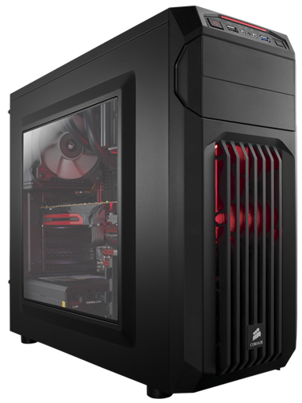

# Spilt-in-Css3-Javascript
Awesome split using CSS3 and Javascript
##crate an awesome split using Javascript and CSS

** index.html**
```<!DOCTYPE html>
<html>
<head>
	<title>Awsome split Using css3 && javascript</title>
</head>
<meta name="viewport" content="width=device-width, initial-scale=1">
<link rel="stylesheet" type="text/css" href="css/main.css">
<body>
<!-- start layout -->
<section id="wrapper" class="skwed">
	<div class="layer bottom">
		<div class="wrapper-content">
			<div class="wrapper-body">
				<h1>Look sharp</h1>
				<p> ipsum dolor sit amet, consectetur adipisicing elit, sed do eiusmod
				tempor incididunt ut labore et dolore magna aliqua. Ut enim ad minim veniam,
				
				
			</div>
			
		</div>
	</div>

	<div class="layer top">
		<div class="wrapper-content">
			<div class="wrapper-body">
				<h1>Stay Cool</h1>
				<p> ipsum dolor sit amet, consectetur adipisicing elit, sed do eiusmod
				tempor incididunt ut labore et dolore magna aliqua. Ut enim ad minim veniam,
				 </p>
				
			</div>
			
		</div>
	</div>
	<div class="handle"></div>
</section>

<!-- End layout -->


<script type="text/javascript" src="js/main.js"></script>
</body>
</html>
```

**style.css**

```
body{
	margin:0;
	padding: 0;
	font-size: 100%;
	line-height: 1.6;
	font-family: Arial halvetica,sans-serif;
}
#wrapper{
	position: relative;
	width: 100%;
	height: 55vw;
	min-height: 55vw;
	overflow: hidden;

}
.layer{
	position: absolute;
	width: 100vw;
	min-height: 55vw;
	overflow: hidden;
}
.layer .wrapper-content{
	position: absolute;
	width: 100vw;
	min-height: 55vw;
}
.layer .wrapper-body{
	width: 25%;
	top: 50%;
	position: absolute;
	text-align: center;
	transform: translateY(-50%);
	color:#fff;
}
.layer img{
	position: absolute;
	width: 35%;
	left: 50%;
	top: 50%;
	transform: translate(-50%, -50%);
}
.layer h1{
	font-size: 2em;
}
.bottom{
	background: #222;
	z-index: 1;

}
.bottom .wrapper-body{
	right: 5%;
}
.bottom h1{
	color: #FDAB00;
}
.top{
	width: 50vw;
	background: #eee;
	color: #222;
	z-index: 2;
}
.top .wrapper-body{
	left: 5%;
	color: #222;
}
.handle{
	position: absolute;
	height: 100%;
	left: 50%;
	top: 0;
	background: #FDAB00;
	width: 5px;
	z-index: 3;
	bottom: 0;
	display: block;
}
.skwed .handle{
	top: 50%;
	transform: rotate(30deg) translateY(-50%);
	height: 200%;
	transform-origin: top;
}
.skwed .top{
	transform: skew(-30deg);
	margin-left: -1000px;
	width: calc(50vw + 1000px);
}
.skwed .top .wrapper-content{
	transform:skew(30deg);
	margin-left: 1000px;
}
@media(max-width: 768px){
	body{
		font-size: 75%;
	}
}
```
